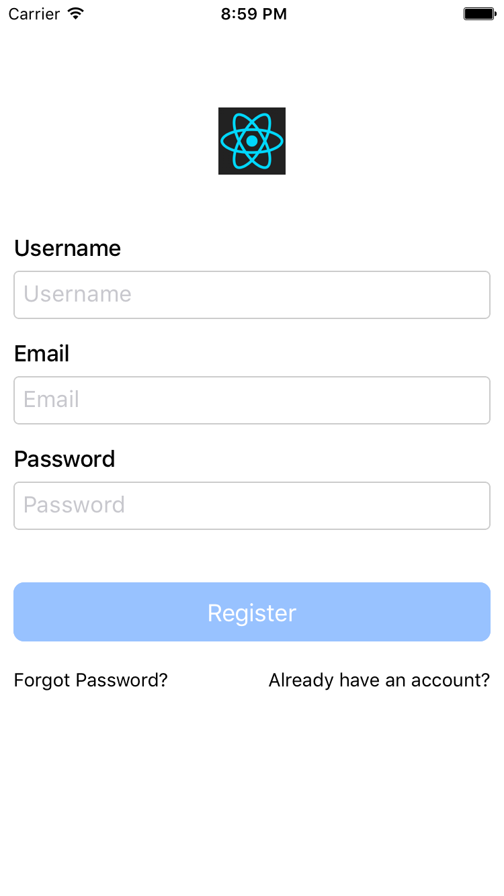

# ReactEngine
一个基于 [Reac Native](https://facebook.github.io/react-native) + [Redux](https://github.com/reactjs/redux) + [Strongloop](https://strongloop.com) 的快速开发框架.  
目的: 快速开发,原则上一个 JS 工程师可以搞定 iOS/Android/Server 开发.

# Client
ReactEngine 客户端部分,基于 [Reac Native](https://facebook.github.io/react-native) + [Redux](https://github.com/reactjs/redux) 的工程模板.

## 如何运行
### 1. 环境准备
安装**最新版** Nodejs: 详见 [nodejs.org](https://nodejs.org/en/download/)   
安装**最新版** React Native: 执行 ```npm install -g react-native-cli``` 详见 [Getting Started](http://facebook.github.io/react-native/docs/getting-started.html)  
如果你要运行 iOS 程序,请安装 Xcode 7.0 更新版本.  
如果你要运行 Android 程序,请参考 [Android Setup](http://facebook.github.io/react-native/docs/android-setup.html).  

#### 2. Clone 仓库并安装依赖:
```
git clone https://github.com/ReactEngine/ReactEngine-Client.git
cd ReactEngine-Client  
npm install -d
```
#### 3. 运行
iOS:    
用 XCode 打开```ios/ReactEngine.xcodeproj```,编译运行.    
Android:   
```
react-native run-android
```

## 截图
iOS:  
<p align="center">
  
  
  
  
  
  
  
  
  
  
</p>